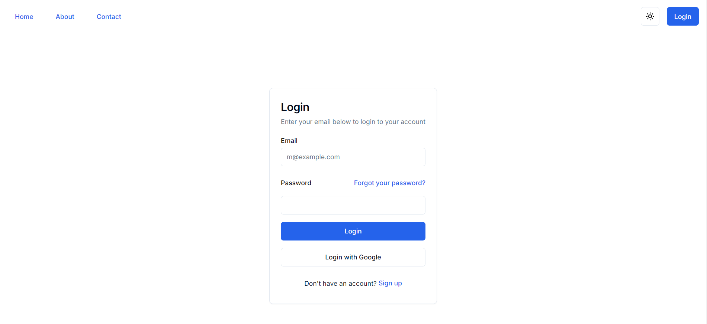
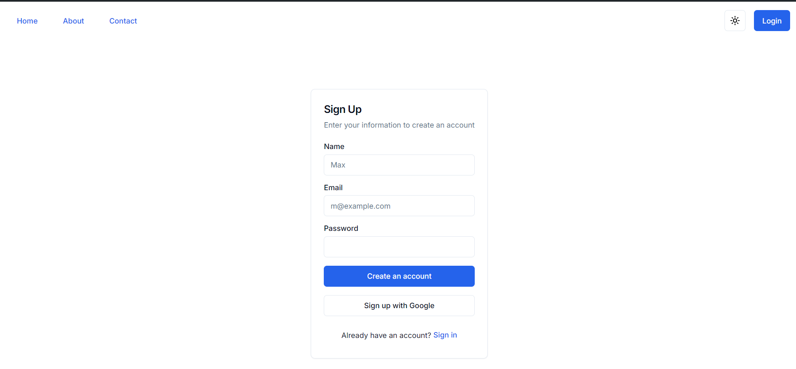

# Project Name

## Overview

Provide a brief description of your project here.

## Table of Contents

- [Installation](#installation)
- [Setup](#setup)
- [Usage](#usage)
- [Contributing](#contributing)
- [License](#license)

## Installation

Follow these steps to install the project:

1. **Clone the repository:**

    ```sh
    git clone https://github.com/your-username/your-repo.git
    cd your-repo
    ```

2. **Install dependencies:**

    Make sure you have [Node.js](https://nodejs.org/) installed. Then run:

    ```sh
    npm install
    ```

3. **Install Prisma CLI:**

    ```sh
    npm install @prisma/cli --save-dev
    ```

## Setup

1. **Environment Variables:**

    Copy the sample environment file and update it with your configuration.

    ```sh
    cp .env-sample .env
    ```

    Edit the [`.env`](command:_github.copilot.openRelativePath?%5B%7B%22scheme%22%3A%22file%22%2C%22authority%22%3A%22%22%2C%22path%22%3A%22%2Fe%3A%2FWebD%2Fauth-template%2Fclient%2F.env%22%2C%22query%22%3A%22%22%2C%22fragment%22%3A%22%22%7D%2C%22776fadd9-e825-4a19-9db2-da2f0ff6ab57%22%5D "e:\WebD\auth-template\client\.env") file to include your database connection string and other environment variables.

2. **Database Migration:**

    Run the following command to apply database migrations:

    ```sh
    npx prisma migrate dev --name init
    ```

3. **Build the project:**

    ```sh
    npm run build
    ```

4. **Start the development server:**

    ```sh
    npm run dev
    ```

## Login



## SignUp:



